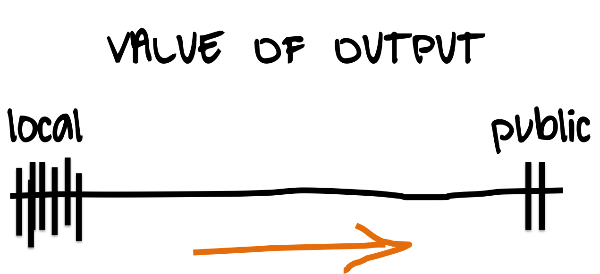

```{r, set-options, echo = FALSE, cache = FALSE}
knitr::opts_chunk$set(
 eval = T, # run all code
 echo = F, # show code chunks in output 
 tidy=T, # make output as tidy
 message = F,  # mask all messages
 warning = F, # mask all warnings 
 out.width="100%",
 size="small", # set code chunk size, 
 knitr::opts_chunk$set(fig.pos = 'H')
)
# options(width = 2000)
# get device output size
# dev.size("px")
```

```{css}

.reveal section img { 
  background:none; 
  border:none; 
  box-shadow:none; 
}

.reveal .small{
  font-size: 60%;
}

```

<p class="small">
These are tips and lessons after a few years of conferencing.  
I've put down everything I think is useful, so don't worry if it feels like a lot.        
Networking skills take time to grow, so treat this content as both the seed and fertiliser.     
</p>


<!-- ____________________________________________________________________________ -->
<!-- start body -->

# On networking {data-background=`r params$bg`}

<!--  -->

## Prior to your conference {data-background=`r params$bg`}

##  

Check the schedule and do some research on people you want to meet, then email them

- > Hi Dr Hooever, I saw you're going to EEID2020 and I wanted to reach out to organise a time to meet up and chat at the conference. I'm a PhD student working on XX. I read your paper on YY and thought it was dope and wanted to pick your brain. Could we organise a time to meet up? 

## 

Have an elevator pitch and have it nailed  

- > I'm Matt Malishev, I'm a postdoc at Emory University working on simulation modelling and bioenergetics in infectious disease ecology.    

## At the conference {data-background=`r params$bg`}

##

People love when you talk to them about their work. However, they don’t know you and won't approach you, so make yourself known instead. 

**Put yourself on people's radars to maximise opportunity**    

## {data-background=`r params$bg2`}

### **Say yes to everything** 

Jump at invites to have a one-on-one for coffee, get lunch, meet at a bar later, etc. 

If you already have an agenda, missing a talk to speak with someone one-on-one is almost always more valuable.   

## Some email correspondence   {data-background=`r params$bg2`}   

> "Please consider applying for this position we have open. The person in this role would work closely with me and my team."  

> "Apply to the link and just give me a heads up when it’s done. I will let the hiring manager know so we can bump you up the queue."

##      

Strike up a conversation with _everyone_. You never know who you'll be talking to, how you relate, where they'll invite you, or what opportunities they have.  

## Some email correspondence   {data-background=`r params$bg2`}   

> "I got your note on LinkedIn. I wanted to make sure you have my email address too, since a lot of my life lives on email. I definitely have you on my radar as we build out our Real Estate/location intelligence business." 
  
##    

Approach speakers after their talks. It creates a platform for dialogue. Trust me, they want to hear from you.    

People will rarely be by themselves, so jump on the opportunity when you see they’re free.  

After your own talk ...  

- Sign off by saying you'll stick around, then stay in the room afterwards  


##

Don’t waste time with people you know already. Make new opportunities. If you find conversation stale, move on. There are plenty of new people around.   

##  

<center>_If you have any trepidation_</center>    

**The Academic-Socialite Paradox**     

A lot of academics are introverted and don’t expect people to approach them, but everyone at conferences is usually deep in conversation.    

# On helping yourself get hired {data-background=`r params$bg`}    

##  

A few public things is infinitely better than lots of local things

<br> 

     

##    

**Have a website**  
 
 - It’s a convenient and dynamic resume
 - It's a talking point  
 - It's sticky    
 - It shows stuff when you don't have stuff to show      

## 

**Have your LinkedIn filled out**    
**Have blog posts or history of your work**  

- If you don't have ideas, make a research notebook of your progress  
- Helps you practise useful skills like writing, coding, web building     
- Start now, now, now  
- > A year from now you'll wish you had started today     
  
##  

You may not be talking to the go-to person at the conference, but they're the conduit to those people.     

- The hiring manager reviews applications, but your contact can infuence them/put you on the right path       

## Some email correspondence {data-background=`r params$bg2`}       

> "Once your application is in, send me an email and I will let our hiring team know to look out for your application."  

## An example from the job market on computational research  

> "Exceptional candidates will have one or more of the following: a working knowledge of Bayesian Hierarchical Modeling; practical experience in near-term forecasting or data assimilation techniques; and/or a track record of publishing peer-reviewed software and data products in addition to manuscripts."    

## 
  
**If you’re in computational research**  

- Some 90% of employers will request your Github handle    
- It’s a great way to show your research activity  
- Packages, web apps, software, and research tools are often hosted on Github so knowing it will make navigating new developments easier    

##  

**If you’re not in computational research**  

(The next points also apply to above)

- It’s 2020, e.g. [plotly](https://dash-gallery.plotly.host/Portal/?search=), [Shiny](https://shiny.rstudio.com/gallery/#user-showcase), [RPubs](https://rpubs.com/)  
- Academic journals are behind in data viz, so not good metrics for next-gen tools     
- Pithy way to showcase your skills with data          
- opensci (open science communication)      
- It’ll help you diversify your skills should you change research paths/your mind later       

# On extra curricular {data-background=`r params$bg`}

## {data-background-iframe="https://darwinanddavis.github.io/EmoRyCodingClub/index.html"}    

##

Your research and manuscripts show only some of your capabilities  

- Manuscripts aren't useful morsels for showing skills and experience 
- Hard skills are often buried in SI or never make the manuscript
- Don't rely on the slow publication pace of journals to show your work    
- **Identify what skills you want to emphasise, then find creative and alternative ways to showcase these. There are tonnes of options to show your work.**       

# On your value {data-background=`r params$bg`}     

##    

- You’re already better than you think   
- You have insightful contributions even if you're early in your career  
- It’s difficult to see your progress, but you’ve progressed way more than you realise. Show people this.        

# Summary {data-background=`r params$bg`}    
  
##  On conferencing    

- It's work. Have an agenda.      
- A little extra prep goes a long way.        
- The best ideas/discussion are over beer/after hours.     
- Aim to get yourself invited to things.       
- Maximise any and every opportunity.      
- Have an online brand and wear it.     


<!-- end body -->  
<!-- ____________________________________________________________________________ -->
